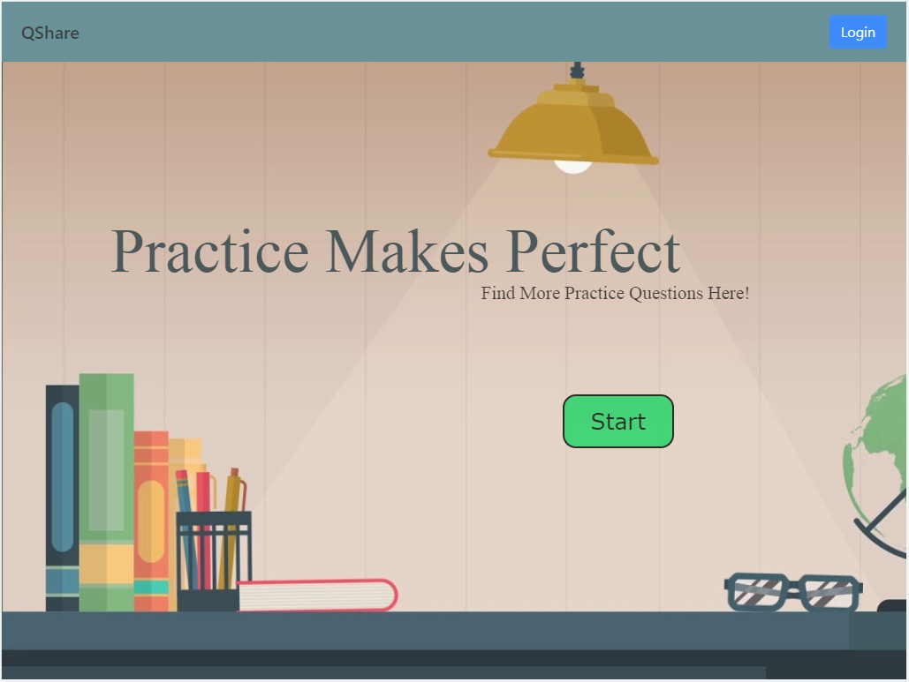
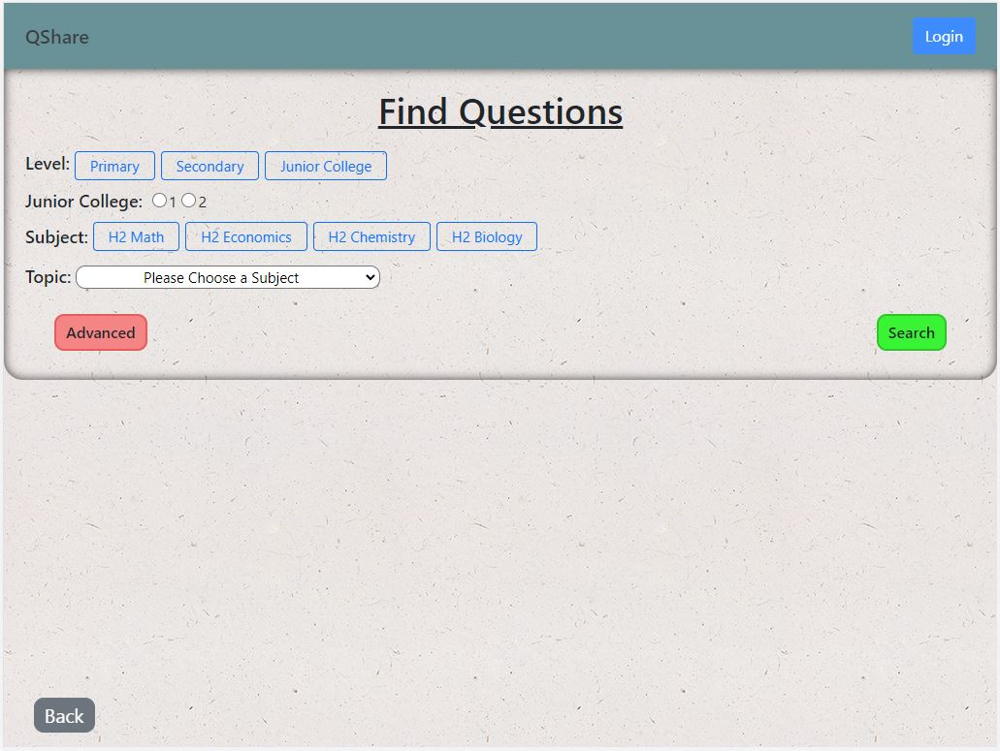
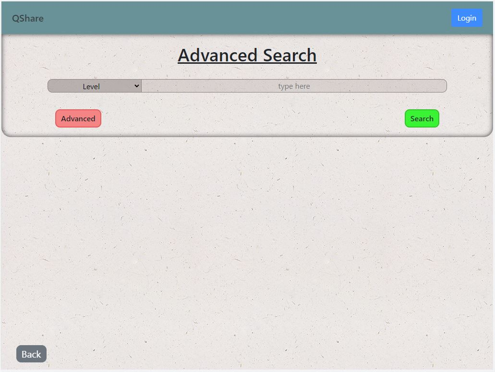
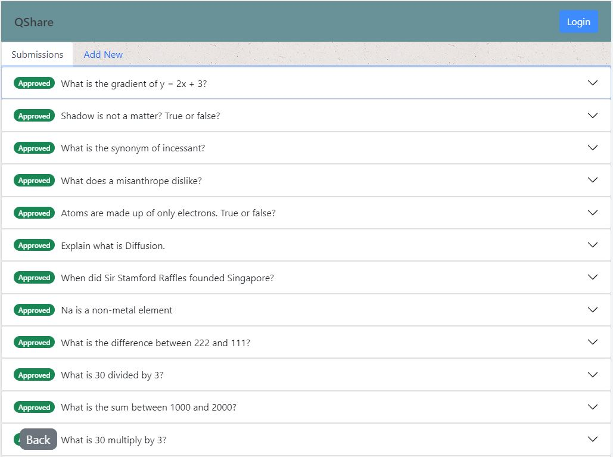
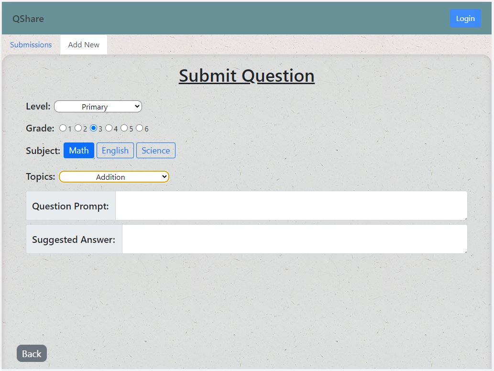

# Project: QShare

 

"Education is the most powerful weapon we can use to change the world."

- Nelson Mandela

 

# Introduction
The project was designed to further improve the accessibility of educational resources for students undergoing Singapore's education curriculum. In Singapore, bookstores are always filled with assessment books where students can purchase to get more practice questions to practice. However, not everyone have the luxury of getting these books/practice questions. Personally, I **firmly** believe that lack of educational resources should not be an obstacle during the course of learning.
 

The next question is, where do we get these resources? When pondering on this question, StackOverFlow came to mind. The place where kind strangers from all around the world share their expertise/knowledge to solve coding issues for others. Can you imagine a world where StackOverFlow is gone? Bizarre, right? With a firm belief and this "sharing/helping culture" notion, **QShare** was conceptualized.
 

**QShare** is the short-form derived from Question Sharing. **QShare** provides the platform for students to find practice questions to get more practice. In addition, it allows the users to contribute questions to the database and share them with others!
 

Together, let's make and effort to make educational resources more available to everyone!

 

# First Look

<h3 align="center" style="font-weight:bold;">Landing Page</h3>

 

Question Page (normal & advanced search)

 

User's Submissions/Contributions

 

Add New Questions

 

## QuickStart
- Deployed Link:
    - https://competent-agnesi-50e277.netlify.app/
- User Guide for Application:
    - (pending)

 

# Technologies Used
- Languages used:
    - HTML & CSS
    - Javascript
- Node.JS
    - Backend runtime environment for API
- MongoDB
    - Database used to store the data
- React.JS
    - Framework for FrontEnd
- Framer Motion
    - Animation of React Components
- Bootstrap (v5.1) - Frontend Library
    - Native 
    - React Version
    - Bootstrap Icons
- axios
    - HTTP client used for HTTP requests (GET, POST, PUT, DELETE)
- RESTful API
    - Base Link for API: https://lys-qshare-2021.herokuapp.com/

 

# Features
- (Default Search) Search for practice questions by level, grade, subject and topic.
- (Advanced Search) Search for practice questions by keywords from level, subject and topic field
- (Registered Users) Add new questions to the database for others to practice
- (Registered Users) Edit submitted questions to update them
- (Registered Users) Delete submitted questions

 

# UI/UX (Surface Plane)
The whole theme of the application is to achieve a minimalistic, clean design with a modern style. 

Color:
- A lot of the color chosen for the interface is blue or a family of blue colors due to its association with the theme "Education". For example, "Subject" buttons, Navigation Bar, etc
- Other colors were chosen based on conventionality. E.g. "Submit" buttons are green, "Delete" buttons are red, "Update" buttons are yellowish.

Images:
- Since the application is going for a minimalistic design, not a lot of images were used.
- The landing page uses a "study area" picture to depict convey the purpose of the website.
- A repeating background image is used for the other interface. This repeating image is chosen to give a "texture" to the application. A non-jarring image was used to fit the minimalistic and clean design.

Fonts:
- Font Color: Generally, most of the fonts are black, with the exception where some texts in buttons are white to allow for better visibility. Or
- Font Sizes: Adjustments are made based on the screen sizes to allow for comfortable reading without giving too much of a "chonky text" feels.
- Typography: To fit the theme of mordern and simple, only sans-serif fonts were used instead of serif fonts where decorative lines are present.

Refer to: https://bit.ly/3Eur3Lx for full UI/UX

 

# Mobile Responsiveness
From the painful experience of Project 1, the strategy for mobile responsiveness this time is to adopt a mobile-first strategy. After the functionality were coded, all the components were styled and adjusted to fit mobile sizing [iPhone X (375px) used as base]. After which, media query was used to adjust the sizing of the elements to fit all the larger resolution devices. 

Below are the devices that can be supported:
- Mobile M (375) to Mobile L (425)
    - iPhone 6/7/8 Plus
    - iPhoneX
- Tablet (768)
    - iPad & iPad Pro
    - Surface Duo
- Laptop (1024)
- Laptop (1440)

 

# Test Cases
Testing is done using test cases. The focus for testing is to make sure that application allows for the searching, adding, updating and deleting of questions.

Test cases can be found in the following link: https://docs.google.com/document/d/1ldeXxDb2wLrwYknFTmNlgId-tdx0KqrqBnOrgrWJwvo/edit?usp=sharing

 

# Bugs
Testing is done after every implementation of function/feature. As such, most of the bugs for a particular function/feature is resolved before moving on to the next.

For more bugs encountered during the project, refer to: https://bit.ly/3Eur3Lx

Below are some of the unresolved bugs:

 

# Incomplete + Possible Improvements
- (incomplete)
- Addition of 

 

# Credits & Acknowledgements
I would like to acknowledge the lead instructor Mr Paul, teaching assistant Haryati, as well as all my classmates for the guidance and emotional support during the duration of this project.

Background images is sourced from these websites:
- https://www.toptal.com/designers/subtlepatterns/ep-natural-white/
- https://wallpapersafari.com/w/rFUMHq#google_vignette

Last but not least, I would like to thank Google and StackOverflow for their unwavering 24/7 support in this project as well.

 

# Disclaimer
This project is for educational purposes only. Other than the idea/concept/mock questions of the project, all media files and technologies used in this project belongs to their respective owners and I do not claim any right over them.

